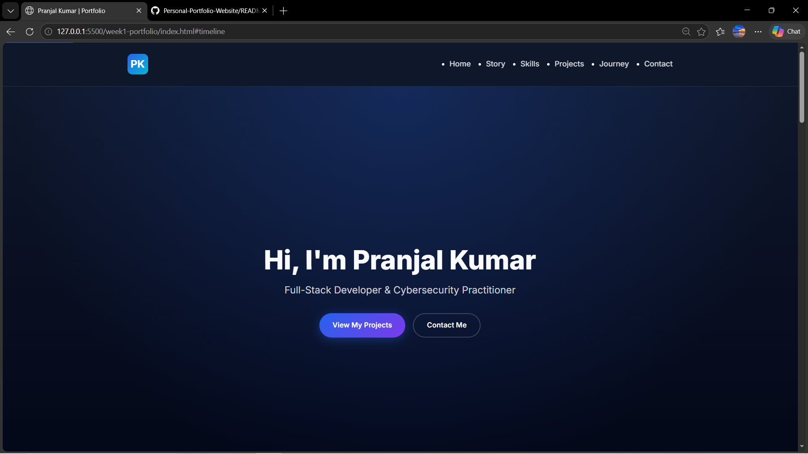
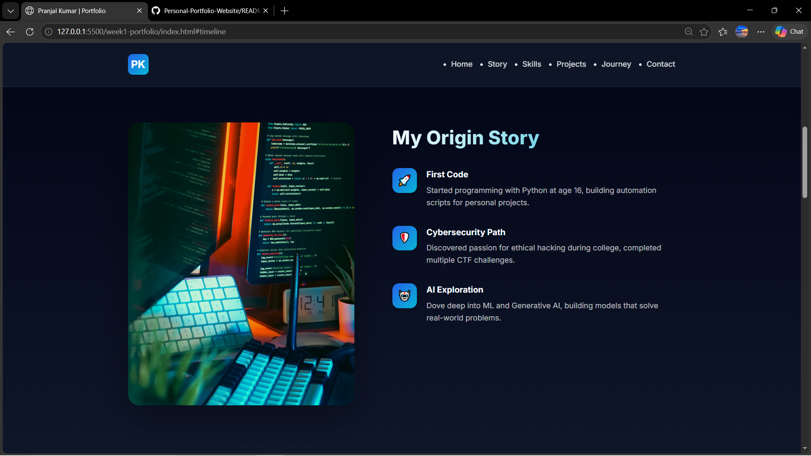
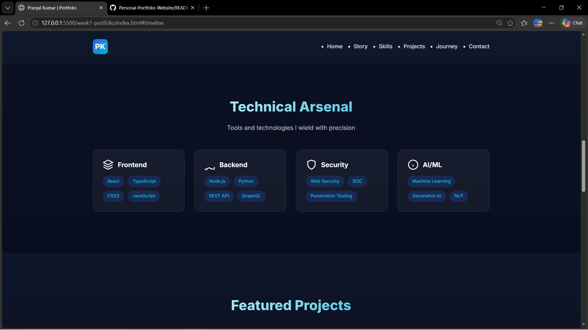
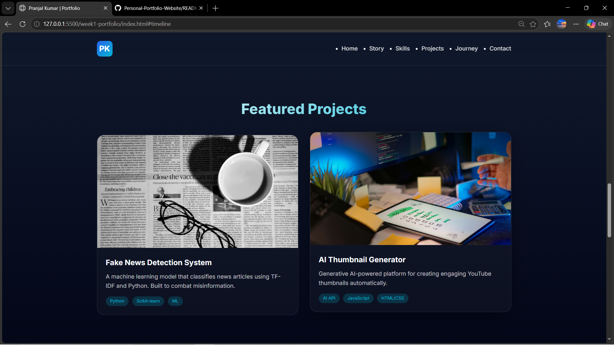
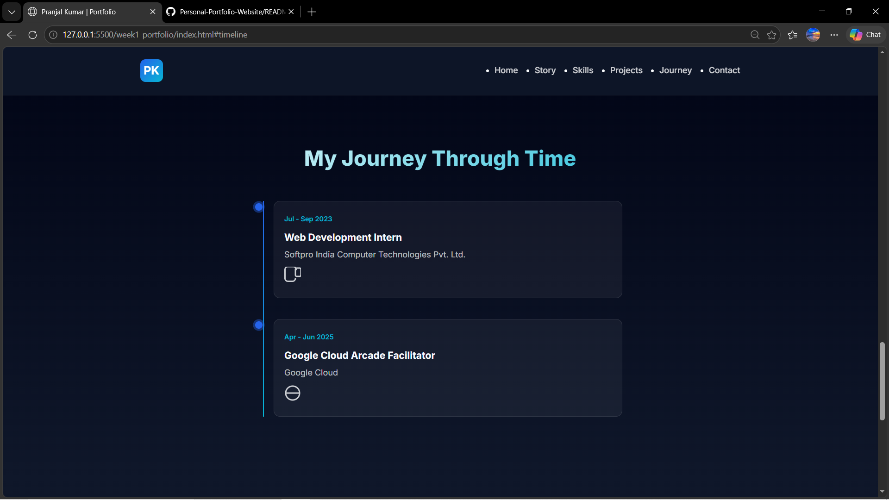
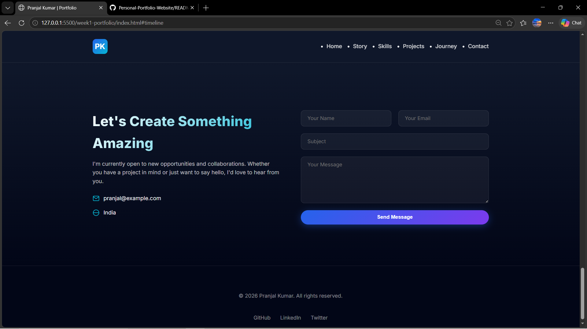

# Personal Portfolio Website - Documentation

## Project Description

A responsive personal portfolio website showcasing skills, projects, and contact information. Built with HTML5, CSS3, and responsive design principles.

## Features

- Responsive design (mobile, tablet, desktop)
- Semantic HTML5 structure
- CSS Grid and Flexbox layouts
- Accessible navigation
- Contact form with validation
- Hover effects and animations

## Technologies Used

- HTML5
- CSS3
- JavaScript (ES6+)
- Git for version control

## Setup and Installation Instructions

1. Clone the repository:
   ```bash
   git clone https://github.com/pranjalKumarglbtim/Personal-Portfolio-Website.git
   ```

2. Navigate to the project directory:
   ```bash
   cd Personal-Portfolio-Website
   ```

3. Open `week1-portfolio/index.html` in your browser

No additional dependencies or server setup required.

## Code Structure Explanation

```
week1-portfolio/
├── index.html          # Main HTML file with semantic structure
├── css/
│   ├── style.css       # Main stylesheet with component styles
│   ├── responsive.css  # Media queries for responsiveness
│   └── variables.css   # CSS custom properties
├── js/
│   └── navigation.js   # Mobile menu toggle functionality
└── images/             # Project screenshots and SVG icons
```

## Screenshots

### Hero Section


### Story Section


### Skills Showcase


### Projects Gallery


### Timeline Section


### Contact Section


## Technical Requirements Met

- **HTML5 semantic elements**: header, nav, main, section, article, footer used throughout
- **External CSS file**: style.css contains organized styles with variables.css for custom properties
- **Responsive design**: Media queries in responsive.css for mobile/tablet/desktop breakpoints
- **Git version control**: Repository initialized with commits, remote origin configured
- **Accessibility**: ARIA labels, skip link, semantic markup
- **Mobile navigation**: JavaScript toggle menu

## Author

**Pranjal Kumar**
- Full-Stack Developer & Cybersecurity Practitioner
- Location: India

## License

© 2026 Pranjal Kumar. All rights reserved.