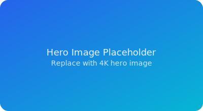

# Personal Portfolio Website

## Project Description

A responsive personal portfolio website showcasing skills, projects, and contact information. Built with HTML5, CSS3, and responsive design principles. The website demonstrates modern web development techniques including semantic HTML, CSS Grid/Flexbox layouts, and mobile-first responsive design.

## Features

- Responsive design (mobile, tablet, desktop)
- Semantic HTML5 structure with proper accessibility
- CSS Grid and Flexbox layouts
- Accessible navigation with ARIA labels
- Contact form with validation
- Hover effects and CSS animations
- Mobile-friendly navigation with JavaScript toggle

## Technologies Used

- HTML5
- CSS3 (Grid, Flexbox, Custom Properties)
- JavaScript (ES6+)
- Git for version control

## Setup and Installation Instructions

1. Clone the repository:
   ```bash
   git clone https://github.com/pranjalKumarglbtim/Personal-Portfolio-Website.git
   ```

2. Navigate to the project directory:
   ```bash
   cd Personal-Portfolio-Website
   ```

3. Open `week1-portfolio/index.html` in your browser

No additional dependencies or server setup required.

## Code Structure Explanation

```
week1-portfolio/
├── index.html          # Main HTML file with semantic structure
├── css/
│   ├── style.css       # Main stylesheet with component styles
│   ├── responsive.css  # Media queries for responsiveness
│   └── variables.css   # CSS custom properties (colors, fonts)
├── js/
│   └── navigation.js   # Mobile menu toggle functionality
└── images/             # Project screenshots and SVG icons
```

### File Details:
- **index.html**: Contains all page content with semantic elements (header, nav, main, section, footer)
- **style.css**: Organized CSS with classes for each component
- **responsive.css**: Media queries for 768px and 1200px breakpoints
- **variables.css**: Color palette and typography settings
- **navigation.js**: Handles mobile menu open/close functionality

## Screenshots

### Hero Section


### Story Section


### Skills Showcase


### Projects Gallery


### Timeline Section


### Contact Section


### Desktop View


### Sections:
1. Hero Banner - Introduction
2. Story Timeline - Origin story
3. Skills Showcase - Technical arsenal
4. Projects Gallery - Featured work
5. Journey Timeline - Work experience
6. Contact Form - Get in touch

## Technical Requirements Met

| Requirement | Implementation |
|-------------|----------------|
| HTML5 semantic elements | header, nav, main, section, article, footer |
| External CSS file | style.css with organized styles |
| Responsive design | Media queries in responsive.css |
| Git version control | 5 commits, remote origin configured |
| Accessibility | ARIA labels, skip link, semantic markup |
| Mobile navigation | JavaScript toggle menu |

## Author

**Pranjal Kumar**
- Full-Stack Developer & Cybersecurity Practitioner
- Location: India

## License

© 2026 Pranjal Kumar. All rights reserved.